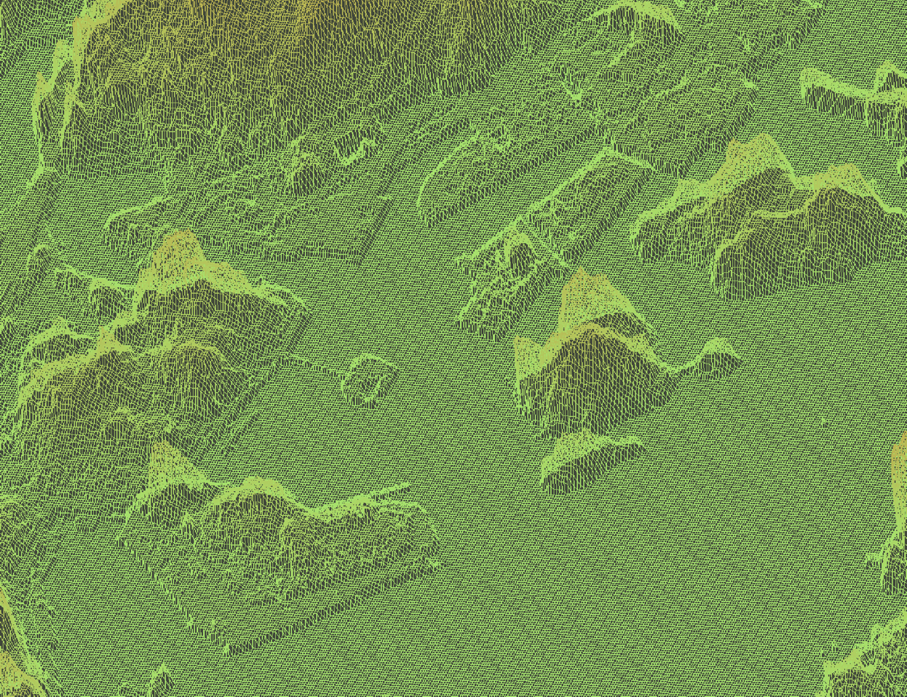
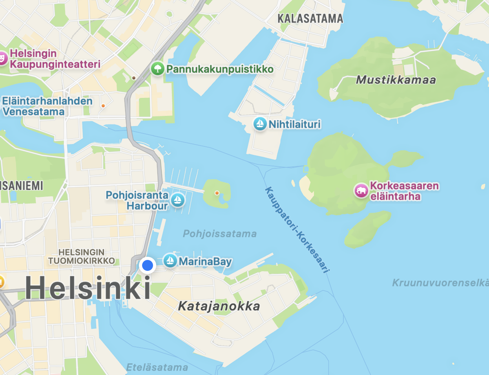
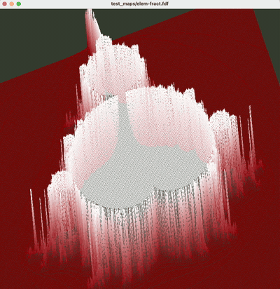

# FdF - Wireframe Renderer

3D wireframe terrain renderer from scratch in C, using 1990s graphics programming techniques.

The program takes a height map and renders it as an interactive rotatable 3D wireframe. Everything implemented by me: [Bresenham line algorithm](https://en.wikipedia.org/wiki/Bresenham%27s_line_algorithm), z-buffering, and [Cohen-Sutherland clipping](https://en.wikipedia.org/wiki/Cohen%E2%80%93Sutherland_algorithm). Interestingly, it can work almost out of the box with topographic data such as from the [National Land Survey of Finland](https://www.maanmittauslaitos.fi/en/maps-and-spatial-data/expert-users/product-descriptions/elevation-model-10-m).

<table>
<tr>
<td width="50%">

</td>
<td width="50%">

</td>
</tr>
<tr>
<td align="center"><em>FdF rendering from elevation data</em></td>
<td align="center"><em>Corresponding area in Apple Maps</em></td>
</tr>
</table>

## Implementation details and further thoughts

No GPU, no shaders, basically only dependent on the primitive 42 interface to GLFW. I used the arena allocator from David Hanson's [C Interfaces and Implementations](https://archive.org/stream/davidr.hansoncinterfacesandimplementationszlib.org/%5BDavid_R._Hanson%5D_C_Interfaces_and_Implementations%28z-lib.org%29_djvu.txt) to great effect. Thank you David! Thank you as well to Michael Abrash for pioneering many of these high-performance software rendering techniques, and, equally importantly, documenting them clearly for posterity in his [Graphics Programming Black Book](https://www.jagregory.com/abrash-black-book/).
Were I to work on this further, I'd love to improve the performance and rendering quality. Implementing [Wu Antialiasing](https://en.wikipedia.org/wiki/Xiaolin_Wu%27s_line_algorithm) would be the obvious next step. I'd also be curious to go in a wildly different direction and rewrite the whole thing for the GPU with e.g. GLSL and see how different that is.

